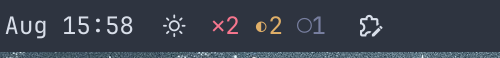
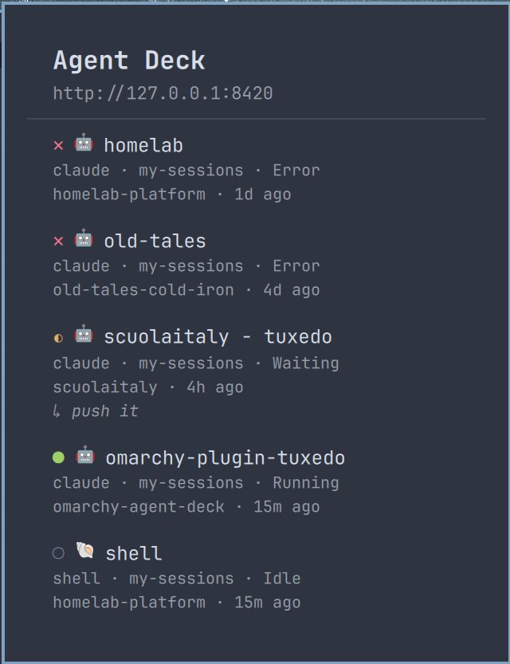

# Agent Deck

Omarchy Quattro bar widget for [agent-deck](https://github.com/asheshgoplani/agent-deck)'s
`agent-deck web` server. Shows live running/waiting/idle/error session counts in the
bar, with a click-through panel listing every session and a link to open it in
agent-deck's own web UI.

Plugin ID: `io.github.giannileggio.agent-deck`.

## Screenshots

| Bar (collapsed) | Panel |
| :---: | :---: |
|  |  |

The panel screenshot is a real fleet, not staged data — that's why it shows
a session waiting on "push it" and one that's this very plugin's own
development session.

## Requirements

- Omarchy Quattro shell.
- `agent-deck web` running and reachable (defaults to `http://127.0.0.1:8420`,
  agent-deck's own default). The widget polls this server directly — it does
  not read tmux or agent-deck's on-disk state, so `agent-deck web` must be
  running for it to show anything but the disconnected state.
- `curl`, `xdg-open`, and `wl-copy` on `PATH` (all standard on an Omarchy/Hyprland install — `wl-copy` ships in `wl-clipboard`).
- `notify-send` (from `libnotify`) on `PATH` — only if `notifyOnAttention` is turned on. Ships alongside Omarchy's default notification daemon (`mako`), so it's already there on a stock install; the widget just doesn't call it unless you opt in.

Start agent-deck's web server with:

```sh
agent-deck web --no-tui          # headless, no separate TUI window
# or just
agent-deck web                   # TUI + web server together
```

## Install

```sh
mkdir -p ~/.config/omarchy/plugins
git clone https://github.com/giannileggio/omarchy-agent-deck.git ~/.config/omarchy/plugins/io.github.giannileggio.agent-deck
```

Then reload plugins (`omarchy plugin list --json` should show `io.github.giannileggio.agent-deck`,
or run `omarchy-shell shell rescanPlugins` / restart the shell) and add it to a
bar slot via Omarchy's plugin settings.

## Uninstall

Remove the widget from its bar slot via Omarchy's plugin settings, then:

```sh
rm -rf ~/.config/omarchy/plugins/io.github.giannileggio.agent-deck
```

That takes `config.local.json` (and the bearer token in it, if any) with it —
there's nothing else this plugin writes outside its own plugin directory.
Reload plugins the same way as install (`rescanPlugins` or a shell restart)
to pick up the removal.

## Configuration

Copy the example config and edit it:

```sh
cp ~/.config/omarchy/plugins/io.github.giannileggio.agent-deck/config.example.json \
   ~/.config/omarchy/plugins/io.github.giannileggio.agent-deck/config.local.json
```

`config.local.json`:

```json
{
  "host": "127.0.0.1",
  "port": 8420,
  "token": "",
  "pollIntervalSeconds": 3,
  "blinkOnAttention": true,
  "notifyOnAttention": false
}
```

| Key | Default | Notes |
|---|---|---|
| `host` | `127.0.0.1` | agent-deck web server host. |
| `port` | `8420` | agent-deck web server port. |
| `token` | `""` (none) | Only needed if you started `agent-deck web --token ...` (e.g. binding non-loopback). Leave empty for the default local/no-auth setup. |
| `pollIntervalSeconds` | `3` | How often the widget polls `GET /api/menu`. |
| `blinkOnAttention` | `true` | Pulse the bar glyph a few times when a session newly starts `waiting` or `error`ing (see below). |
| `notifyOnAttention` | `false` | Also fire a desktop notification (`notify-send`) for the same event. Off by default since it's an external side effect, not just chrome. |

`config.local.json` is **gitignored on purpose** — it's where the bearer
token lives, and it should never end up committed alongside this plugin's
code. `config.example.json` (committed) is just a template; the widget falls
back to the defaults above if `config.local.json` is missing entirely, so a
default local `agent-deck web` (no `--token`) needs no config file at all.

The file is re-read every few seconds, so editing it takes effect live
without restarting the shell — through a small bounded/symlink-safe shell
helper rather than a raw file load, since it holds the bearer token (see
`Model.configReadCommand` for the boundary it enforces).

## What it shows

The bar glyph is a compact per-status count, e.g. `✕1 ◐2 ●3`, each glyph in
its own color. Both glyph shapes and colors match agent-deck's own
`StatusIndicator()`/`ToolColor()`-style fixed palette (`internal/ui/styles.go`,
dark theme) exactly, so a session reads the same way here as in agent-deck's
own TUI — same as the tool icons above:

| Glyph | Status | Color |
|---|---|---|
| `✕` | error | `#f7768e` (agent-deck's `ErrorIndicatorStyle` red) |
| `◐` | waiting | `#e0af68` (agent-deck's `WaitingStyle` yellow) |
| `●` | running (incl. starting/queued, shown as `⟳` per-session in the panel) | `#9ece6a` (agent-deck's `RunningStyle` green) |
| `○` | idle (incl. stopped) | `#787fa0` (agent-deck's `IdleStyle` gray) |

These are fixed hex values (`Model.statusColorHex`), not derived from the
active Omarchy theme — a deliberate choice to have this plugin's status
colors read as *agent-deck's own* colors, not reinterpreted through whatever
Omarchy theme happens to be active. `starting` uses agent-deck's own
`WaitingStyle` (yellow, "not running yet") rather than green; `queued` isn't
in agent-deck's own switch at all and is grouped with `starting` here for the
same reason `glyphForStatus` groups them (see its comment).

Everything else in this plugin's chrome (panel background, borders, the
disconnected-state `⚠` glyph) stays Omarchy-theme-derived. `Panel.qml`'s
`mutedReadable` (translucent foreground rather than the theme's own
low-contrast `Color.muted` — it measured ~1.7:1 against the bar/popup
background in Nord, under WCAG's 3:1 floor even for large text) is what the
disconnected glyph and every secondary panel line use.

Zero-count statuses are omitted, so an all-idle fleet reads as `○4`, not
`✕0 ◐0 ●0 ○4`.

Hovering the bar glyph opens a panel listing every session (status, title,
tool badge, group), sorted so whatever needs attention is at the top. It
opens shortly after the pointer settles on the icon (so passing over it on
the way elsewhere doesn't flash it open); closing is a click — the icon
again, or anywhere else — or `omarchy-shell shell hide`/IPC, same as any
other bar panel. It does *not* auto-close on hover-out: once the panel is
open, the framework's own full-screen dismiss overlay sits on top of the bar
and stops routing pointer motion back to this widget, so "is the pointer
still over the icon" can't be trusted anymore right after opening — a
hover-to-close mirror of the open logic was tried and closed the panel on
its own about a second after opening even with the pointer held still. See
the comment above `iconHovered` in `Panel.qml`.

Each session row shows a tool icon next to the title — 🤖 claude, 💻 codex,
✨ gemini, 📝 cursor, ☤ hermes, 🌐 opencode, 🐚 shell, and a few more,
each in that tool's brand color. These are ported directly from agent-deck's
own TUI (`internal/ui/styles.go`'s `IconClaude`/`ToolIcon()`/`ToolColor()`)
— plain Unicode emoji and the exact colors agent-deck itself renders, not
bundled vendor logo files, so a session reads the same way here as it does
in agent-deck's own interface. See `Model.toolIcon`/`toolColorHex`.

Each row also shows the project's directory name and how long ago the
session was last touched (e.g. `omarchy-agent-deck · 3m ago`), so two
sessions sharing a title in different repos, or one that's gone stale, are
easy to tell apart at a glance. A `waiting` session additionally shows its
latest prompt/output on its own line (`↳ push it`) — agent-deck's own
`latestPrompt` field — so you can see what it's actually stuck on without
opening it.

Clicking a session opens it in agent-deck's own web UI (`/s/{id}`) in your
default browser. Hovering a row also reveals a small copy icon on the right;
clicking it copies `tmux attach -t <session>` to the clipboard (via
`wl-copy`) so you can jump into the session's real terminal instead. This is
the only per-row action — it's read-only from agent-deck's point of view (no
HTTP call), unlike stopping, restarting, or archiving a session, which this
plugin deliberately does not expose from a hover-opened popup.

If `agent-deck web` isn't reachable, the glyph shows `⚠` and the panel
explains what to check, rather than erroring or crashing the shell.

## Attention alerts

A session flipping to `waiting` (it wants input) or `error` (it failed) is
the one kind of status change worth interrupting whatever you're doing for —
everything else (idle, running, starting/queued) is a session making
progress on its own. When a poll finds a session newly in one of those two
states — it wasn't already `waiting`/`error` a moment ago, matched by
session id — the widget can:

- **Blink** (`blinkOnAttention`, on by default): the bar glyph pulses a
  few times, independent of the glyph's own per-status color.
- **Notify** (`notifyOnAttention`, off by default): a desktop notification
  via `notify-send`, titled with the session's new status and name, urgency
  `critical` for `error` and normal for `waiting` — so it stays on screen
  until dismissed (on notification daemons that honor urgency, e.g. Omarchy's
  default `mako`) for the case that actually failed.

Both react to the same event and can be enabled independently. A session
that's still `waiting` on the next poll doesn't re-trigger either — only the
transition into that state does; `error` -> `waiting` (e.g. a retry) counts
as a new transition since the specific state changed. The very first poll to
ever succeed after the shell starts has nothing to compare against, so any
session already `waiting`/`error` at that moment counts as new too — you get
flagged about a fleet that was already stuck rather than the widget quietly
adopting it as normal. A session that's still `waiting`/`error` across a
later, temporary disconnect from `agent-deck web` does *not* re-trigger on
reconnect — only that first-ever poll gets this treatment.

## Known limitations

- **Poll-based, not push.** agent-deck's web server does expose a live SSE
  stream (`GET /events/menu`), but every first-party Omarchy bar-widget plugin
  that fetches external data (weather, network, etc.) uses a short-lived
  `curl` `Process` on a `Timer` rather than a long-running streaming child
  process — this plugin follows that same convention rather than the SSE
  endpoint, for consistency and because a persistent streaming subprocess is
  an unusual shape in this framework. Default interval is 3s; lower
  `pollIntervalSeconds` for snappier updates at the cost of more `curl` calls.
- **`agent-deck web`'s HTTP API is not a documented/versioned contract.** It's
  agent-deck's own web UI's backend, well-tested but with no stability
  promise across versions. All fetch/parse logic is isolated in `Model.js` —
  if a future agent-deck release changes the `/api/menu` response shape,
  that's the one file to patch.
- Only the four core statuses (`running`/`waiting`/`idle`/`error`) get their
  own glyph; agent-deck's transitional states (`starting`, `queued`) fold into
  "running" and `stopped` folds into "idle" for the bar count (the panel still
  shows each session's exact status).
- No settings UI (host/port/token/interval are edited by hand in
  `config.local.json`, not through Omarchy's plugin settings form).

## Development

```sh
omarchy plugin validate ~/.config/omarchy/plugins/io.github.giannileggio.agent-deck
# qmllint isn't on PATH by default on a stock Arch/Omarchy install — it
# ships with qt6-declarative at /usr/lib/qt6/bin/qmllint.
/usr/lib/qt6/bin/qmllint -I "$OMARCHY_PATH/shell" BarWidget.qml Panel.qml
```

The `qs.Commons`/`qs.Ui` import-resolution warnings, `BarWidget`/`Panel`
"inheritance cycle", and `missing-property` warnings on `panelLoader.item`
are expected noise from `qmllint` not having the shell's full build context
— they show up identically on Omarchy's own first-party `weather`/`clock`
plugins, not something specific to this one.

## License

MIT — see [LICENSE](LICENSE). Matches agent-deck's own license.
